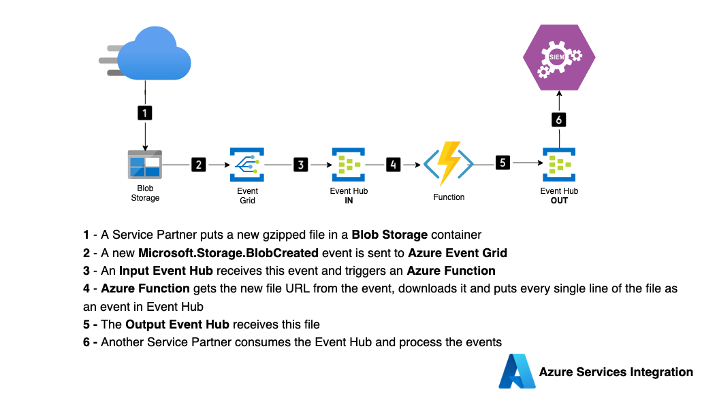

# About this project
This repository showcases a scenario of services integration in Azure where logs placed in a Blob Storage container gets processed into a Event Hub leveraging Event Grid and Functions.

## Architecture 



## Usage

### Create the infrastructure using ```terraform```

```
$ cd terraform
$ az login
$ terraform init
$ terraform plan -var 'services-integration-rg=<resource_group_name>'
$ terraform apply
```

### Deploy the services-integration ```Function```

```
cd functions/services-integration
func azure functionapp publish siem-integration-<suffix>
```

### Upload fake log files to the source-blobs container

```
$ az storage blob upload-batch --account-name <storage-account-name> -d source-blobs -s log-files
```

### Watch the log files entries being added as events in the destination Event Hub

```
$ export EVENT_HUB_CONN_STR="<Event Hub Connection String>"
$ export EVENT_HUB_NAME=integration-hub
$ pip install azure-eventhub
$ python event-hub-consumer.py
```